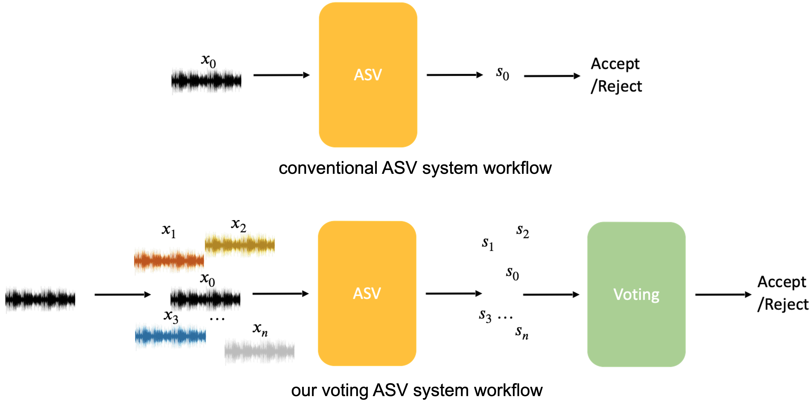

# voting for the right answer

* [audio samples](https://zyzisyz.github.io/voting_audio_samples/)
* [arxiv paper](https://arxiv.org/abs/2106.07868)

<center>

</center>

## installation

```bash
git clone https://github.com/thuhcsi/adsv_voting
cd adsv_voting
git clone https://github.com/thuhcsi/torch_speaker
cd torch_speaker
pip install -r requirements.txt
python setup.py develop
cd ..
cp -r torch_speaker/{tools,scripts} .
```

## experiments

### stage 1: data preparation

```bash
rm -rf data; mkdir data
wget -P data/ https://www.robots.ox.ac.uk/~vgg/data/voxceleb/meta/veri_test.txt
echo format trails
python3 scripts/format_trials.py \
			--voxceleb1_root $voxceleb1_path \
			--src_trials_path data/veri_test.txt \
			--dst_trials_path data/vox1.txt
```

### stage 2: ASV model evaluation

```bash
python3 tools/evaluate.py \
			--config config/voting.yaml \
			--trial_path data/vox1.txt \
			--checkpoint_path $checkpoint_path
```

### stage 3: adversarial attack and examples generation

```bash
python3 local/attack.py \
			--config config/voting.yaml \
			--trial_path data/vox1.txt \
			--checkpoint_path $checkpoint_path
```

### stage 4: voting for the defense

```bash
python3 local/defense.py \
			--config config/voting.yaml \
			--trial_path data/vox1.txt \
			--checkpoint_path $checkpoint_path
```
